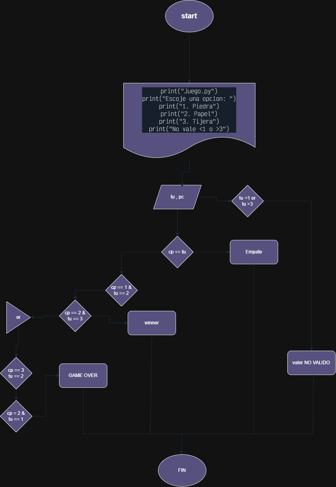

Piedra, Papel o Tijera - ¡Un clásico reinventado en Python! 🎮
-

##### Bienvenido a mi versión digital del icónico juego de "Piedra, Papel o Tijera". Este es un sencillo pero entretenido juego donde podrás enfrentarte contra la computadora en un duelo por la victoria. 🥇

### Instrucciones de juego 📝
Al iniciar el juego, se te pedirá que elijas entre tres opciones:
-
```
1. Piedra 🪨
2. Papel 📄
3. Tijera ✂️
La computadora seleccionará su jugada de manera aleatoria.
¡Es hora del enfrentamiento! Según las reglas tradicionales:
La piedra vence a la tijera.
El papel vence a la piedra.
La tijera vence al papel.
El resultado será mostrado: empate, victoria o derrota.
Reglas especiales ⚠️
Solo se permiten valores válidos entre 1 y 3. Si ingresas un número fuera de ese rango, el juego te lo notificará.
¿Podrás derrotar a la computadora en este duelo de ingenio y suerte?
¡Ponte a prueba y ve cuántas veces puedes ganar en este sencillo pero adictivo juego! 🤖💥👤
````

